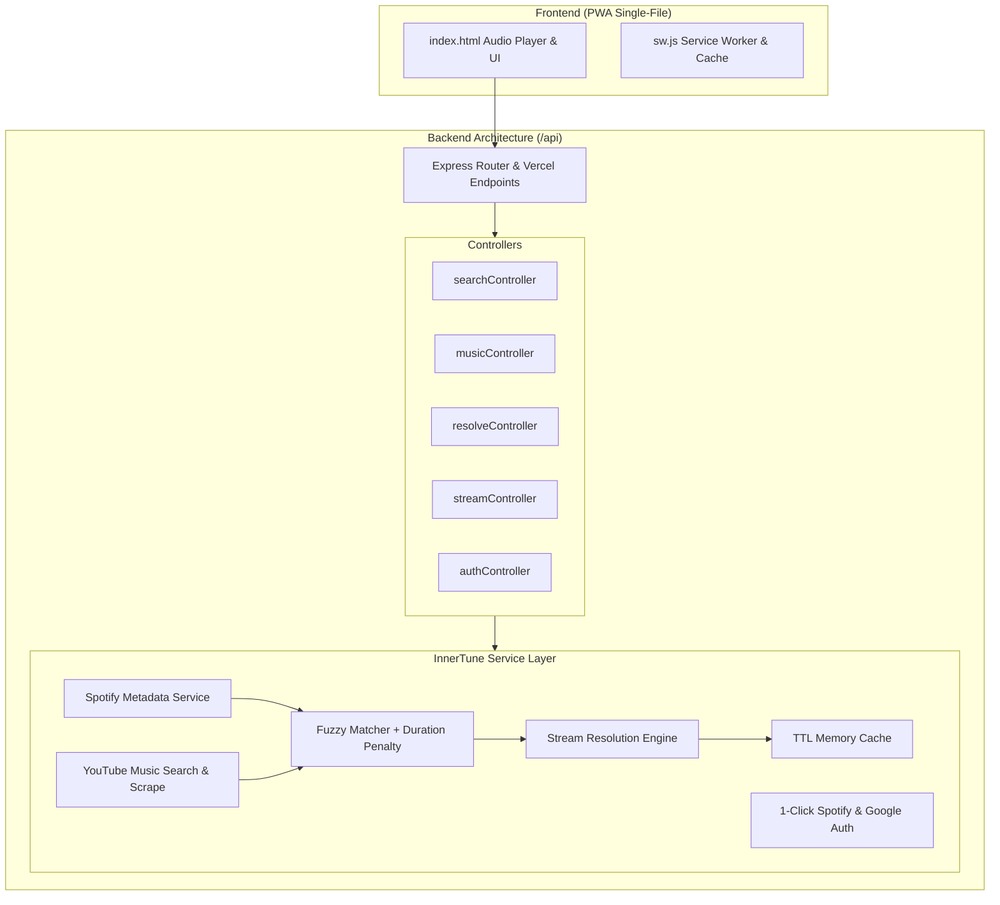

# 🎵 Preluded (V2 - InnerTune Backend Architecture)

A web music progressive web app (PWA) with a storefront UI inspired by Apple Music, backed by an **InnerTune-inspired Node.js / Express and Serverless architecture** bridging Spotify metadata and YouTube Music stream resolution.

---

## 🌟 Architecture Overview



### Key Features
- **Zero Frontend UI Regressions**: The existing frontend interface, typography, glassmorphism design, and animations in `index.html` are 100% preserved.
- **InnerTune-Style Hybrid Architecture**:
  - **Metadata & Catalog**: Uses Spotify Web API (Client Credentials or OAuth) for high-accuracy artist discographies, album tracks, and search indexing.
  - **Track Resolver & Matcher**: Calculates Levenshtein string similarity and Token Set ratio, penalizing mismatches with duration thresholds ($\pm 7\text{s}$).
  - **Audio Extraction**: Resolves candidate tracks to direct, playable audio streams (m4a/opus/mp3) with automatic caching and renewal.
- **Frictionless 1-Click Login**:
  - Instant guest mode without mandatory login barriers.
  - 1-click Google sign-in.
  - 1-click Spotify sign-in.
  - Device-code TV login flow support (`/api/auth/yt/get-code`).
- **Deploy Anywhere**: Works seamlessly as a standalone Express server (`npm start`) or as Vercel Serverless Functions (`/api/*`).

---

## 🚀 Quick Start (Local Setup)

### 1. Install Dependencies
```bash
npm install
```

### 2. Configure Environment Variables
Copy `.env.example` to `.env`:
```bash
cp .env.example .env
```

```ini
PORT=3000
NODE_ENV=development

# Optional: Spotify Credentials (https://developer.spotify.com/dashboard)
SPOTIFY_CLIENT_ID=your_spotify_client_id
SPOTIFY_CLIENT_SECRET=your_spotify_client_secret
SPOTIFY_REDIRECT_URI=http://localhost:3000/api/auth/spotify/callback

# Optional: Google OAuth Credentials (https://console.cloud.google.com)
GOOGLE_CLIENT_ID=your_google_client_id
GOOGLE_CLIENT_SECRET=your_google_client_secret
GOOGLE_REDIRECT_URI=http://localhost:3000/api/auth/google/callback
```

> **Note**: Even without any `.env` keys, the app starts and runs out of the box with the built-in offline music catalog and fallback resolver.

### 3. Run the Server
```bash
npm start
```
Open your browser at: `http://localhost:3000`

---

## 🧪 Testing & Verification

Run the automated endpoint test suite:
```bash
npm run test:api
```

Run the frontend inline script syntax validator:
```bash
npm run check
```

---

## 📡 API Contract Reference

| Endpoint | Method | Params | Description |
| :--- | :---: | :--- | :--- |
| `/health` | `GET` | — | Health check and cache status |
| `/api/search` | `GET` | `s` (track), `a` (artist), `al` (album), `q` | Returns normalized search results |
| `/api/info` | `GET` | `id` | Returns track metadata, artists, albums, and mix ID |
| `/api/track` | `GET` | `id`, `quality` | Returns base64 encoded stream manifest for player |
| `/api/mix` | `GET` | `id` | Returns track recommendations and radio items |
| `/api/artist` | `GET` | `id` or `f` | Returns artist metadata, top tracks, and discography |
| `/api/artist/similar` | `GET` | `id` | Returns similar/related artists |
| `/api/album` | `GET` | `id` | Returns album details and track list |
| `/api/resolve` | `GET` | `title`, `artist`, `duration_ms` | Resolves track to YouTube videoId with confidence score |
| `/api/stream-url` | `GET` | `videoId` | Returns direct playable audio URL with TTL |
| `/api/auth/spotify/login` | `GET` | `redirect=true` | 1-Click Spotify OAuth login URL |
| `/api/auth/google/login` | `GET` | `redirect=true` | 1-Click Google OAuth login URL |
| `/api/auth/yt/get-code` | `GET` | — | TV Device Code flow initiator |
| `/api/auth/session` | `GET` | — | Active provider and connection state |

---

## 📂 Project Structure

```
web-music/
├── server.js                  # Main Express server entry point
├── config/
│   └── env.js                 # Environment configuration loader
├── middleware/
│   ├── auth.js                # Token authorization middleware
│   ├── cors.js                # CORS configuration
│   ├── errorHandler.js        # Centralized error handler
│   └── requestLogger.js       # Request logging
├── lib/
│   ├── catalogData.js         # Rich fallback offline music catalog
│   ├── fuzzyMatcher.js        # InnerTune fuzzy matching + duration penalty
│   ├── httpClient.js          # HTTP fetch client with retries & timeout
│   └── manifestGenerator.js   # Base64 stream manifest generator
├── services/
│   ├── authService.js         # Spotify PKCE + Google OAuth + Device flow
│   ├── cacheService.js        # In-memory TTL key-value cache
│   ├── spotifyService.js      # Spotify Web API client (metadata/search)
│   ├── youtubeMusicService.js # YouTube Music search & scrape engine
│   ├── trackResolverService.js# Track matcher bridging Spotify -> YouTube
│   └── streamResolutionService.js # Direct audio stream extractor
├── controllers/
│   ├── authController.js      # Auth route handlers
│   ├── musicController.js     # Info, track, mix, artist, album handlers
│   ├── resolveController.js   # Track resolve handler
│   ├── searchController.js    # Multi-provider search handler
│   └── streamController.js     # Direct stream URL handler
├── routes/
│   ├── index.js               # Main API aggregator router
│   ├── authRoutes.js          # /api/auth/*
│   ├── healthRoutes.js        # /health
│   ├── musicRoutes.js         # /api/info, /api/track, etc.
│   ├── resolveRoutes.js       # /api/resolve
│   ├── searchRoutes.js        # /api/search
│   └── streamRoutes.js        # /api/stream-url
├── api/                       # Vercel Serverless Function entrypoints
├── index.html                 # Complete Apple Music-style PWA frontend
├── manifest.json              # Web app manifest
├── sw.js                      # Progressive Service Worker
└── tools/
    ├── check_script.js        # Frontend syntax validator
    └── test_api.js            # Automated API contract test suite
```

---

## 📄 License

GPL-3.0 License
